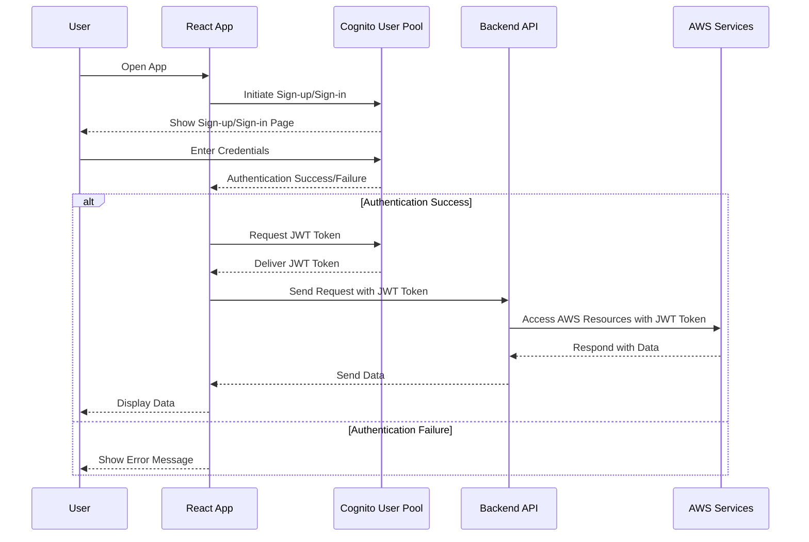

# Amazon Cognito

## What

Cognito provides a secure and scalable way to manage user authentication and authorization for your applications.

## How

It provides two main components:

- **User pools** and
- **Identity pools**.

**User pools** handle user sign-up, sign-in, and management, while **Identity pools** provide temporary AWS credentials for accessing other AWS services.

> > **NOTE**  
> > **IAM (Identity Access Manager)** is focused on controlling access to AWS resources and what action is allowed/denied. Cognito is focused on controlling access for end users.

Cognito also supports various authentication flows, including password-based, federated (with third-party providers like Google or Facebook), and custom flows using Lambda triggers.

### User Pools

Consider the folliwing before you create your user pool:

1. Define Your User Attributes

   - Required Attributes: Determine which user attributes are mandatory during sign-up (e.g., email, phone number).

   - Optional Attributes: Decide which additional attributes you want to collect (e.g., name, address, custom fields).

   - Attribute Type: Choose the appropriate data type for each attribute (e.g., string, number, boolean, date).

2. Configure Sign-in Options

   - Sign-in Method: Select how users will sign in (e.g., username, email address, phone number).

   - Case Sensitivity: Determine if usernames or email addresses should be case-sensitive.

3. Set up Password Policies

   - Minimum Length: Specify the minimum password length.

   - Required Characters: Define which character sets are required (e.g., uppercase letters, lowercase letters, numbers, symbols).

   - Temporary Passwords: Configure the expiration time for temporary passwords.

4. Configure Multi-Factor Authentication (MFA)

   - Enable MFA: Decide whether to require MFA for added security.

   - MFA Options: Choose the MFA methods to support (e.g., SMS, Time-based One-Time Password - TOTP).

5. Customize the User Experience

   - Sign-up and Sign-in Pages: Determine if you'll use the default Cognito hosted UI or create custom pages.

   - Customization: If using the hosted UI, customize its appearance (e.g., logo, CSS).

   - Email and SMS Configuration: Configure how verification and password reset emails/SMS messages are sent. You can use Amazon SES or a third-party provider.

6. Integrate with Identity Providers (IdPs)

   - Social IdPs: If needed, configure integration with social identity providers like Google, Facebook, and Apple.

   - SAML IdPs: Integrate with enterprise identity providers using SAML 2.0.

   - OpenID Connect (OIDC) IdPs: Integrate with other OIDC-compliant providers.

7. Configure User Pool Settings

   - User Pool Name: Choose a descriptive name for your user pool.

   - Region: Select the AWS region where you want to create the user pool.

   - Tags: Optionally add tags to help organize and manage your user pools.

At this point you need to create one or more App Clients. An app client is the configuration for the application that requires Cognito to authenticate its user. Applications can share the configuration or have seperate configutation.

8. Set up App Clients

   - App Client Name: Create one or more app clients to represent your applications (web, mobile, etc.).

   - Client ID and Secret: Note the Client ID (and secret, if applicable), which your application will use to interact with the user pool.

   - Allowed OAuth Flows: Select the OAuth 2.0 flows that the app client can use (e.g., Authorization Code Grant, Implicit Grant, Client Credentials Grant).

   - Allowed Callback URLs: Specify the URLs that Cognito can redirect to after successful authentication.

   - Sign-out URLs: Specify URLs that Cognito can redirect to after a user signs out.

9. Add User Pool Groups (Optional)

   - Create Groups: Create groups to organize your users and assign permissions.

   - Assign IAM Roles to Groups: Associate IAM roles with groups to control access to AWS resources.

   - Add Users to Groups: Assign users to the appropriate groups.

10. Configure Advanced Security

    - Device Tracking: Decide whether to enable device tracking to recognize user devices.

    - Adaptive Authentication: Enable adaptive authentication to detect unusual sign-in activity.

    - Compromised Credentials Check: Enable checks for compromised credentials.

## Scenarios

Following

